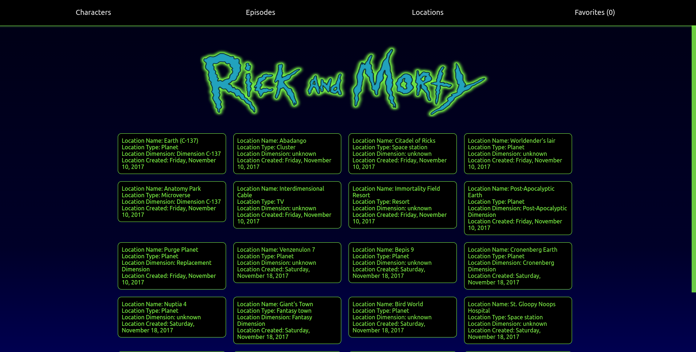
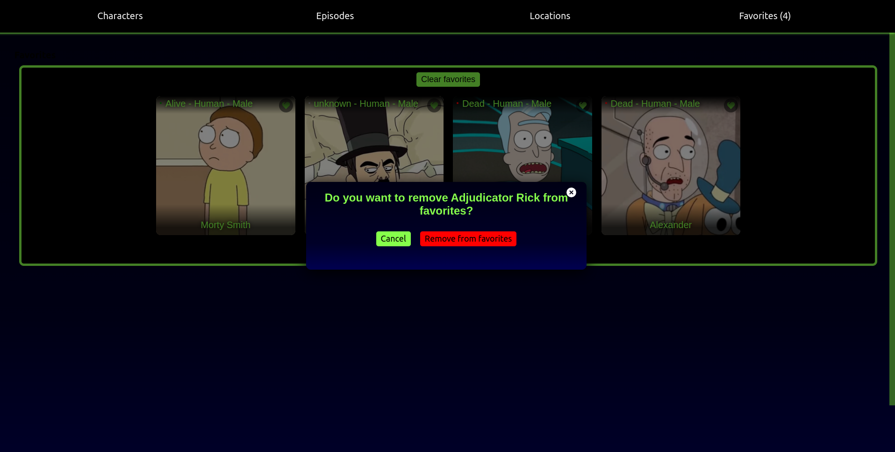

# Rich and Morty Application

## Description

Rick and Morty application is a simple application that allows you to search for characters from the Rick and Morty series. The application uses the [Rick and Morty API](https://rickandmortyapi.com/).

## Installation

Use the package manager [npm](https://www.npmjs.com/) to install the application.
npm 18.0.1 or higher is recommended.

```bash
$ git clone
$ cd rick-and-morty-frontend
$ npm install
$ npm dev run
```

or

docker

```bash
$ git clone
$ cd rick-and-morty-frontend
$ docker compose up -d
```

> This will start the application on port 3000. You can change the port in the docker-compose.yml file and vite.config.js file.

## Technologies

- React
- Redux
- Redux Thunk
- React Router
- SCSS

## Screenshots

### Home and Episodes


### Characters 


### Locations




### Character details


### Location details


### Episode details


### Favorites





